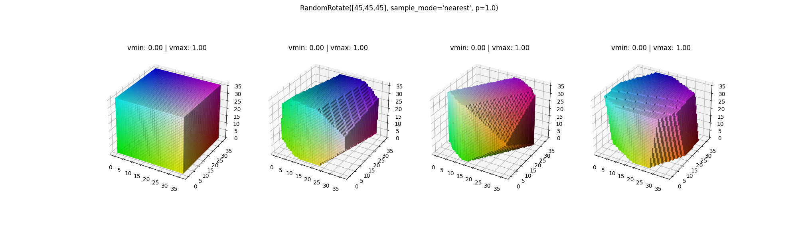
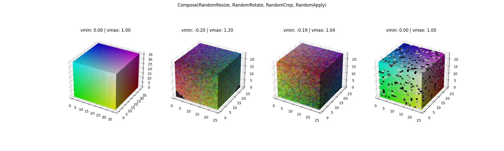

# torch traNDsforms

<div align="center">

[](https://github.com/alexandrainst/torch-trandsforms/actions/workflows/build.yml?query=branch%3Amain)
[](https://pypi.org/project/torch-trandsforms/)
[](https://github.com/alexandrainst/torch-trandsforms/pulls?utf8=%E2%9C%93&q=is%3Apr%20author%3Aapp%2Fdependabot)

[](https://github.com/psf/black)
[](https://github.com/PyCQA/bandit)
[](https://github.com/alexandrainst/torch-trandsforms/blob/main/.pre-commit-config.yaml)
[](https://github.com/alexandrainst/torch-trandsforms/releases)
[](https://github.com/alexandrainst/torch-trandsforms/blob/main/LICENSE)


A pytorch-first transform library for ND data, such as multi-channel 3D volumes

</div>

## Features

torch traNDsforms is an easy to use transform library for N-dimensional PyTorch data

 - Differentiable, accelerated ND transformations with most tensors
 - One transform pipeline for all your data using `KeyedTransforms`
 - Customizable and lightweight
 - No superfluous dependencies
 - Collaborative

## Installation

```bash
pip install torch_trandsforms
```

or

```bash
poetry add torch-trandsforms
```

or potentially

```bash
conda install torch_trandsforms
```

## Usage

Creating a single transform that rotates both input data and ground truth data. The data is considered 3D with a leading channel dimension.



```python
import torch
from torch_trandsforms import RandomRotate

# create data and target
input_tensor = torch.rand((3,16,16,16), device="cuda", dtype=torch.float32)
target_tensor = torch.rand((1,16,16,16), device="cuda", dtype=torch.float32)

# create our random rotator, which rotates dim -3 from -90 to 90, dim -2 from -90 to 90, and dim -1 from -180 to 180
# this operates only on inputs with the keynames "input" or "target" and in the trailing 3 dimensions
rotator = RandomRotate((90,90,180), nd=3, keys=["input", "target"], align_corners=True)

# transform the data and target
transformed = rotator(input=input_tensor, target=target_tensor)

# the data is recovered using the same keys as in the input
data = transformed["input"]
target = transformed["target"]
```

Create a Compose object to run a sequence of transforms one after another:



```python
import torch
from torch_trandsforms import Compose, RandomResize, RandomRotate, RandomCrop, RandomApply, UniformNoise, GaussianNoise, SaltAndPepperNoise

# create data and target
input_tensor = torch.rand((3,16,16,16), device="cuda", dtype=torch.float32)
target_tensor = torch.rand((16,16,16), device="cuda").round()

# create our transform pipeline using some shape/size augmentation on both input and target, as well as some noise on the input
transform = Compose([
    RandomResize(0.3, p=0.75, keys="*"),  # keys="*" is the same as keys=["foo", "bar"] here
    RandomRotate([180,180,180], sample_mode="nearest", p=0.9, nd=3, keys=["foo", "bar"]),
    RandomCrop(16, padding=0, p=1.0, keys="*"),  # nd is 3 by default - but nd=1,2,3 all work here, just on the trailing dimensions
    RandomApply([
        UniformNoise(p=1.0, low=-0.2, hi=0.2, keys=["foo"]),  # for most noise transforms, we only want the data to be augmented
        GaussianNoise(mean=torch.tensor(0.0, device="cuda"), std=0.05, p=1.0, keys=["foo"]),
        SaltAndPepperNoise(0.2, low=0.0, hi=1.0, a=torch.tensor(0.5, device="cuda"), p=1.0, copy_input=True, keys=["foo"])
    ], min=1, max=1)  # apply exactly 1 of the above three transforms each time
])

# transform the data and target
transformed = transform(foo=input_tensor, bar=target_tensor)

# the data is recovered using the same keys as in the input
data = transformed["foo"]
target = transformed["bar"]
```

For more examples of use, see [EXAMPLES.md](https://github.com/alexandrainst/torch-trandsforms/blob/main/examples/EXAMPLES.md)

## Speed

Please see [TIMING.md](https://github.com/alexandrainst/torch-trandsforms/blob/main/TIMING.md) for timings. See [test_speed.py](https://github.com/alexandrainst/torch-trandsforms/blob/main/test_speed.py) for methodology.

## Support

Please use [Issues](https://github.com/alexandrainst/torch-trandsforms/issues) for any issues, feature requests, or general feedback.

## Roadmap

For now, traNDsforms is in early alpha. That will continue for a while, while basic functionality is implemented.

The roadmap is determined by the collaborative efforts of every user that provides feedback, reports bugs, or produces pull requests. Thank you!

For now, the roadmap looks something like this:
 - [x] Implement basic functionality (normalize, dtype changing, change device)
 - [x] Implement value-level noise functionality (uniform, salt and pepper, gaussian)
 - [x] Implement structural transforms (cropping, flipping)
 - [x] Implement placeholder transforms for not-yet-ND-capable transforms (arbitrary rotation, scaling)
 - [x] More examples, including better visuals
 - [x] Development structure: Lock main && publish
 - [ ] Move basic functionality to _functional and _utils

Later additions (and reasons for postponing):
 - [ ] Arbitrary rotations (missing ND affine_grid and grid_sample)
 - [ ] Gaussian Blur (missing implementation of ND convolution)
 - [ ] Affine transformations (missing efficient ND computation)

Potential additions:
 - [ ] ND Bounding Boxes
 - [ ] Geometric operations using PyTorch Geometric
 - [ ] Point clouds, meshes using PyTorch 3D
 - [ ] Data loading, sampling, and structures
 - [ ] torchscript compatibility

## Contributing

See [Contributing](https://github.com/alexandrainst/torch-trandsforms/blob/main/CONTRIBUTING.md)

## Authors

The project is maintained by developers at the [Alexandra Institute](https://alexandra.dk/)

 - Oliver G. Hjermitslev (ohjerm) <oliver.gyldenberg@alexandra.dk>

...to be expanded...

## License

See the [MIT License](https://github.com/alexandrainst/torch-trandsforms/blob/main/LICENSE)

## 📃 Citation

```bibtex
@misc{torch-trandsforms,
  author = {Alexandra Institute},
  title = {A pytorch-first transform library for ND data, such as multi-channel 3D volumes},
  year = {2023},
  publisher = {GitHub},
  journal = {GitHub repository},
  howpublished = {\url{https://github.com/alexandrainst/torch-trandsforms}}
}
```
