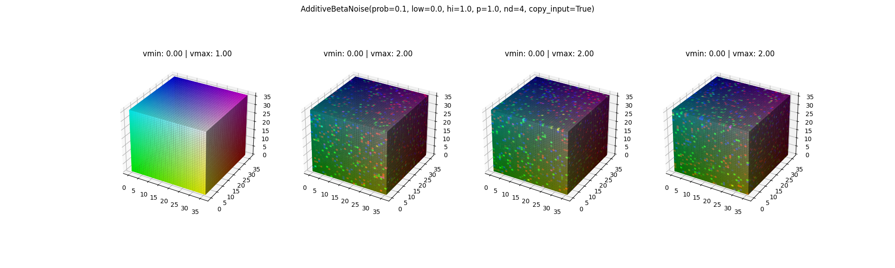
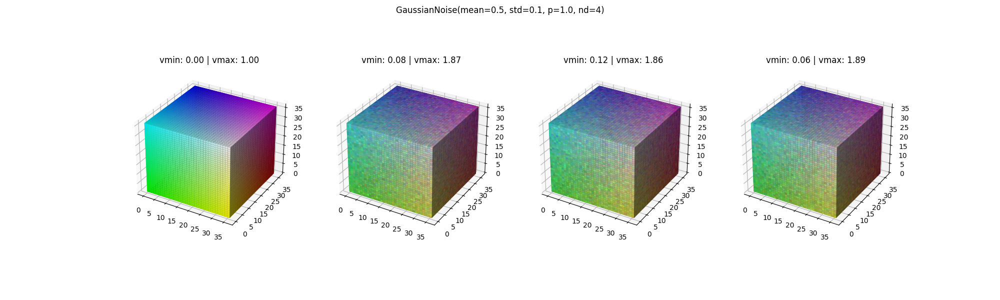
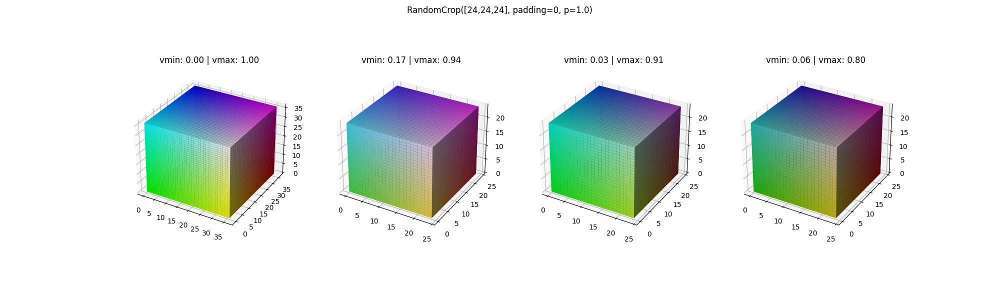
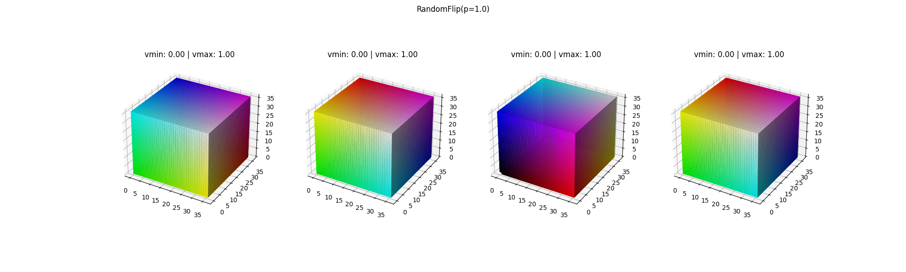
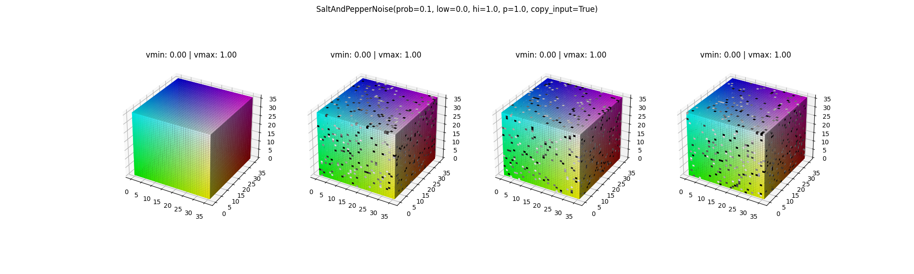
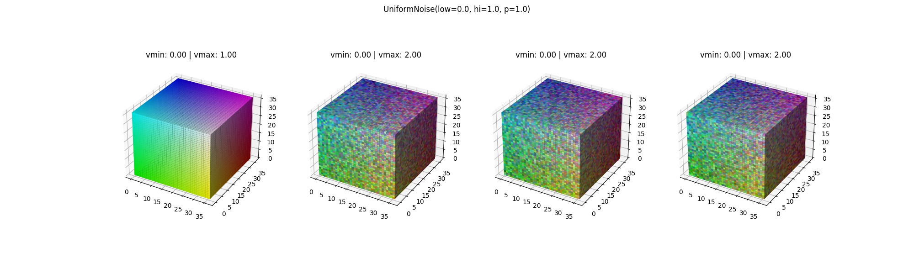

# Examples of Use

Below are examples of outputs from a number of traNDsforms

The input cube is an RGB cube of size 3,36,36,36

The output size is expected to be 3,36,36,36 unless otherwise specified (crop, for example)

The colour values are scaled to the range 0-1. The original min/max values are attached as titles.

## Compose and Random Apply

```python
transform = Compose([
        RandomResize(0.3, p=0.75),
        RandomRotate([180,180,180], sample_mode="nearest", p=0.9),
        RandomCrop(24, padding=0, p=1.0),
        RandomApply([
            UniformNoise(p=1.0, low=-0.2, hi=0.2),
            GaussianNoise(std=0.05, p=1.0),
            SaltAndPepperNoise(0.2, low=0.0, hi=1.0, p=1.0, copy_input=True)
        ], min=1, max=1)
    ])
```


## Additive Beta Noise



## Gaussian Noise



## RandomCrop



## Random Flip



## Random Resize


## Random Rotate


## Random Rotate 90


## Salt and Pepper Noise



## Uniform Noise


